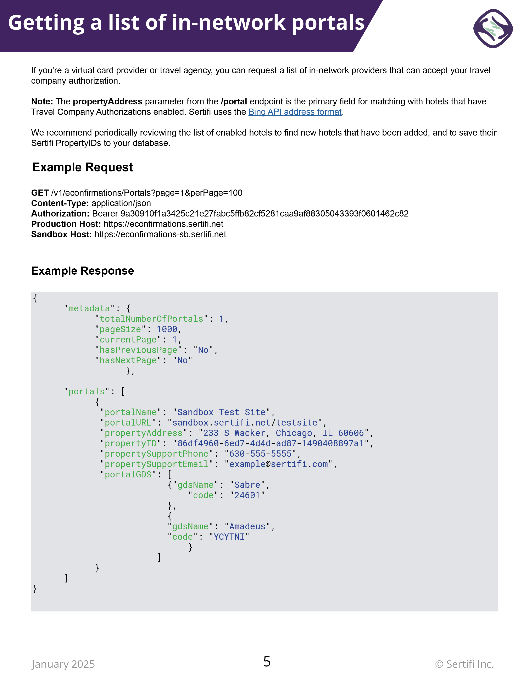
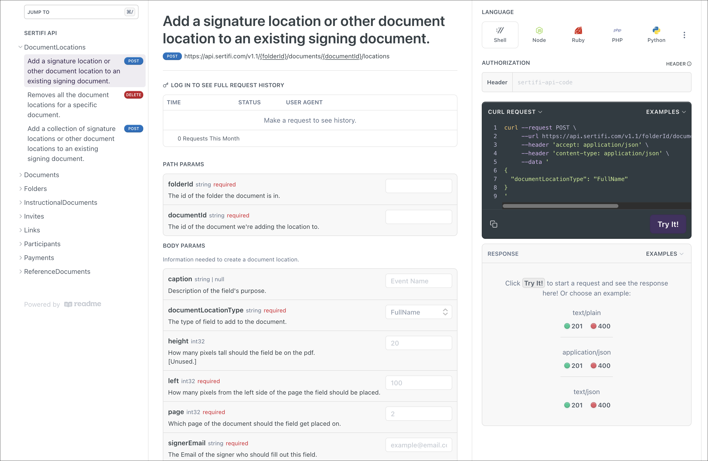

#### API Demo Guide

The marketing and implementation teams at Sertifi liked having PDF guides for customer reference, so I took the old versions and added some quality of life upgrades, including:

* Syntax highlighting
* URLs for the production and sandbox environments
* Company branding, logos, and improved document navigation

#### Developer Center

Through [Readme](https://readme.com/), I created a developer center that allowed clients to test their API connections in their production or test environments.

