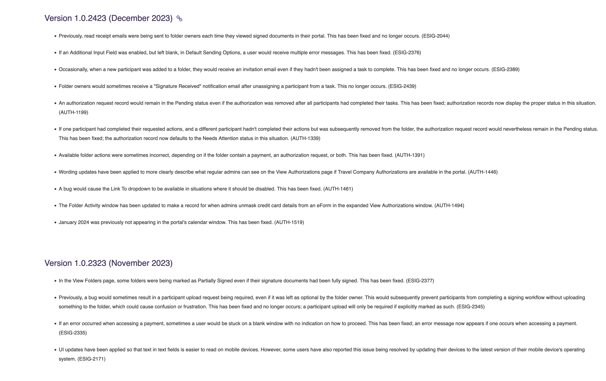
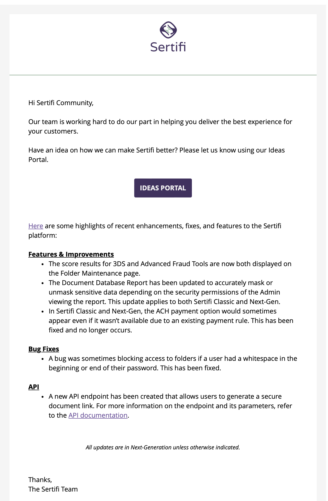

# Release Notes

At Sertifi, I completely rebuilt how release notes were written, categorized, and published. Notable improvements included:

* The addition of development ticket numbers, expediting the diagnosis of problems related to release items
* Implementation of [semantic versioning](https://semver.org/), to better communicate what had changed in the release and its attendant impact on API access
* Biweekly release note emails to notify customers of new features, performance improvements, and bug fixes

