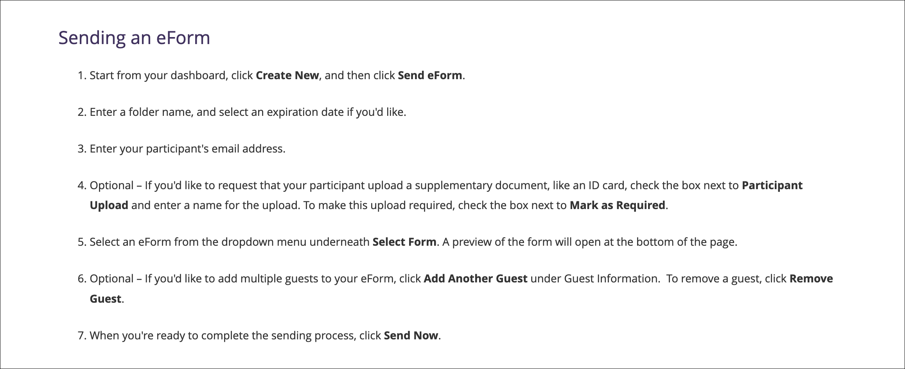
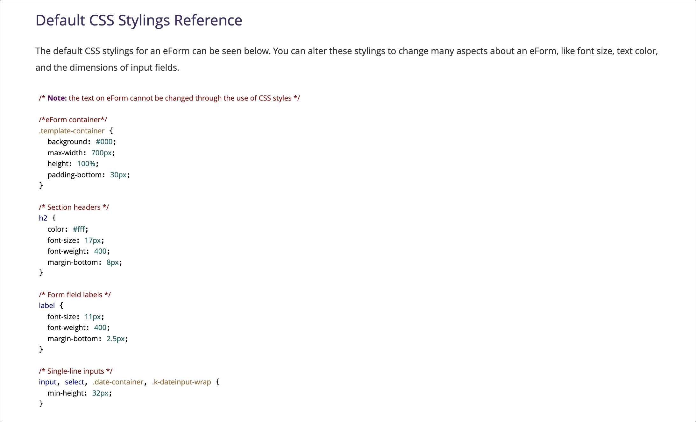

As the technical writer at Sertifi, I completely rebuilt the customer support site ahead of a complete overhaul of the company's primary software products. This process included cleaning up old documentation, removing years of outdated information, and creating completely new documentation for the new versions of the products. I also completely reconfigured how [support videos](video.md) were written, produced, and published.

