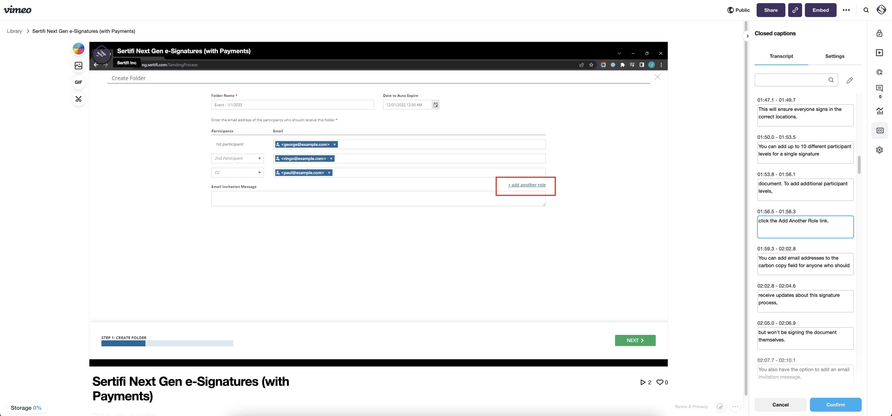
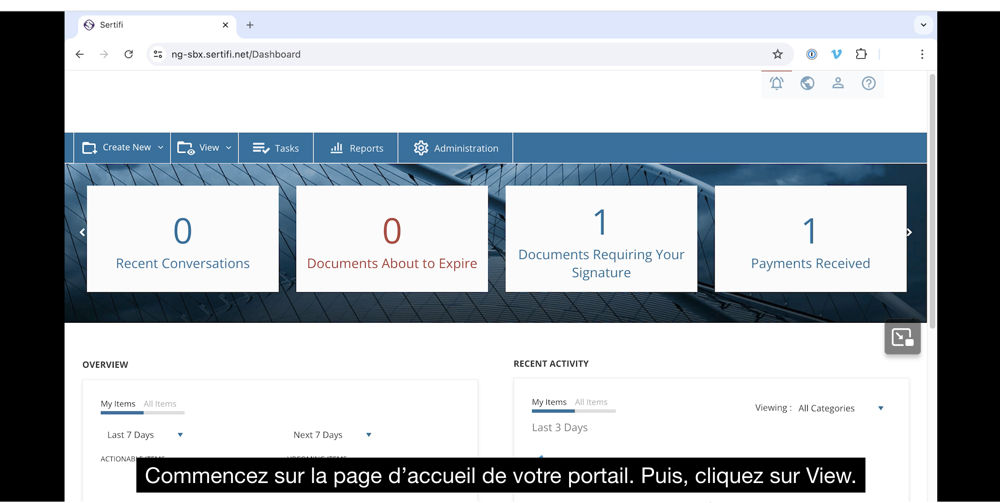

As part of rebuilding [Sertifi's support center](support_sites.md), I created new workflows for how support videos were created, produced, and published. These videos were written, narrated, designed, animated, and edited by me.

 

<iframe src="https://player.vimeo.com/video/897250205?badge=0&amp;autopause=0&amp;player_id=0&amp;app_id=58479" frameborder="0" allow="autoplay; fullscreen; picture-in-picture" style="position:absolute;top:0;left:0;width:100%;height:100%;" title="Guide Video Demo (Short)"></iframe>

For accessibility and usability purposes, I also went through each caption to correct for spelling, grammar, and product language.

To further improve accessibility, I began writing French subtitles for the videos as well.

